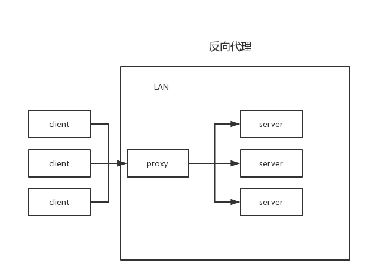

# 🌐 前端开发中的代理服务器实践

> **📖 本文档深入探讨代理服务器在前端开发中的应用，并分享解决跨域问题的系统方法**

---

## 📋 目录

- [背景介绍](#背景介绍)
- [同源策略详解](#同源策略详解)
- [跨域问题解析](#跨域问题解析)
- [解决方案对比](#解决方案对比)
- [实践案例](#实践案例)
- [进阶方案](#进阶方案)

---

## 🎯 背景介绍

在从0到1搭建插件项目脚手架的过程中，**跨域问题**是前端开发者常遇到的挑战之一。  
本文将通过实践案例，深入探讨代理服务器在前端开发中的应用，并分享解决跨域问题的系统方法。

---

## 🔒 同源策略详解

### 什么是同源策略？

同源策略（Same-Origin Policy, SOP）是浏览器的一个重要安全策略，它规定了不同源之间的文档或脚本在交互时需要遵循的规则。

### 同源的定义

同源策略的核心是**源的定义**，源由以下三个部分组成：

| 组成部分 | 说明 | 示例 |
|---------|------|------|
| **协议** | HTTP/HTTPS | `http://` vs `https://` |
| **主机** | 域名/IP | `www.example.com` vs `api.example.com` |
| **端口** | 端口号 | `:8080` vs `:8081` |

> **💡 只有当两个源的协议、主机和端口完全相同时，它们才被认为是同源的**

### 同源策略的作用

| 作用 | 说明 |
|------|------|
| **🔒 安全保护** | 防止恶意网站窃取用户数据 |
| **🛡️ 数据隔离** | 限制不同源之间的文档或脚本交互 |
| **🔐 隐私保护** | 保护用户的敏感信息 |

**示例场景：**
假设用户登录了一个银行网站，然后又打开了一个恶意网站。如果没有同源策略，恶意网站就可以通过脚本访问银行网站的页面内容，从而窃取用户的敏感信息。

---

## 🌍 跨域问题解析

### 跨域的概念

跨域问题通常是由浏览器的同源策略引起的访问问题。同源策略是浏览器的一个重要安全机制，它用于限制一个来源的文档或脚本如何能够与另一个来源的资源进行交互。

### 跨域产生的原因

| 原因 | 说明 | 示例 |
|------|------|------|
| **前后端分离** | 前端代码和后端API部署在不同服务器 | 前端：`www.example.com`，API：`api.example.com` |
| **不同协议** | HTTP vs HTTPS | `http://example.com` vs `https://example.com` |
| **不同端口** | 开发环境常用 | `localhost:3000` vs `localhost:8080` |
| **子域名不同** | 同一主域名下的不同子域名 | `www.example.com` vs `api.example.com` |

### 跨域问题的发展历程


> **🎯 关键点：** 在静态资源服务器和API服务器是同一台服务器时，是没有跨域问题的。

---

## 🛠️ 解决方案对比

### 本地开发环境解决方案

我们学习这些东西主要是要学思想，'一法通，万法通'。
想要在本地开发时避开浏览器的同源策略，实现跨域访问，那么就得增加一层代理。因为前端是不能直接访问服务器的，会被限制。但是服务器是可以访问服务器的。

#### 🔄 代理服务器方案

**核心思想：** 想要在本地开发时避开浏览器的同源策略，实现跨域访问，那么就得增加一层代理。因为前端是不能直接访问服务器的，会被限制。但是服务器是可以访问服务器的。


> **💡 提示：** Webpack、Vite本地起的开发服务，其实就是用的这个代理架构。

#### 🚀 实践案例：基于esbuild的代理配置

```typescript
/**
 * 这是基于esbuild.dev.ts的配置
 * 我们用http.createServer起了本地服务器，当匹配到/api前缀的请求时，
 * 利用中间件createProxyMiddleware转发，最终成功调用API服务器接口。
 */
const esbuild = require('esbuild');
const path = require('path');
const fs = require('fs-extra');
const { createProxyMiddleware } = require('http-proxy-middleware');
const http = require('http');

async function build() {
  // 构建配置
  const buildConfig = {
    entryPoints: ['./src/index.tsx'], // React入口文件
    bundle: true,
    metafile: true,
    outfile: './dist/bundle.js', // 明确指定输出文件
    format: 'iife', // 使用立即执行函数格式
    globalName: 'ExtensionApp', // 全局变量名
    target: ['es2020'],
    sourcemap: true,
    minify: true, // 生产环境启用压缩
    define: {
      'process.env.NODE_ENV': '"production"'
    },
    jsx: 'automatic', // 关键配置：使用现代 JSX 转换
    jsxImportSource: './src/index.tsx',
    jsxFactory: 'React.createElement',
    jsxFragment: 'React.Fragment',
    // 将React标记为外部依赖（因为已通过CDN引入）
    external: ['react', 'react-dom'],
    loader: {
      '.ts': 'tsx',
      '.tsx': 'tsx',
      '.css': 'css'
    },
    // 注入React全局变量
    inject: [path.resolve(__dirname, '../src/react/react-shim.js')],
    // 解决动态 require 问题
    banner: {
      js: `
        window.require = function(module) {
          if (module === 'react/jsx-runtime') {
            return {
              jsx: React.createElement,
              jsxs: React.createElement,
              jsxDEV: React.createElement,
              Fragment: React.Fragment
            };
          }
          throw new Error('Dynamic require of "' + module + '" is not supported');
        };
      `
    }
  };

  try {
    console.log('🔨 开始构建...');

    // 执行esbuild构建
    const result = await esbuild.build(buildConfig);

    if (result.errors.length > 0) {
      console.error('❌ 构建失败:', result.errors);
      return;
    }

    console.log('✅ JS构建完成');

    // 复制HTML模板到dist目录
    const templatePath = path.resolve(__dirname, '../src/template/index.html');
    const distPath = path.resolve(__dirname, '../dist/index.html');

    // 确保dist目录存在
    await fs.ensureDir(path.dirname(distPath));

    // 读取HTML模板
    let htmlContent = await fs.readFile(templatePath, 'utf-8');

    // 在HTML中注入JS引用
    const scriptTag = '<script src="./bundle.js"></script>';

    // 在</body>标签前插入script标签
    htmlContent = htmlContent.replace('</body>', `  ${scriptTag}\n</body>`);

    // 写入到dist目录
    await fs.writeFile(distPath, htmlContent, 'utf-8');

    const ctx = await esbuild.context(buildConfig);

    // 先进行一次初始构建，这会触发HTML插件生成HTML文件
    await ctx.rebuild();
    console.log('✅ 初始构建完成');

    // 环境变量配置
    const SESSION_COOKIE = "xxx";

    let apiProxy;
    try {
      apiProxy = createProxyMiddleware({
        target: 'https://xxxxxx',
        changeOrigin: true,
        secure: false,
        rejectUnauthorized: false,
        pathRewrite: {
          '^/api': '/api'
        },
        onProxyReq: (proxyReq: any, req: any, res: any) => {
          console.log(`🔄 代理请求开始: ${req.method} ${req.url}`);

          // 添加必要的请求头
          // proxyReq.setHeader('Origin', 'xxxxxx');
          // proxyReq.setHeader('Referer', 'xxxxxx');
          // proxyReq.setHeader('x-requested-with', 'XMLHttpRequest');
          proxyReq.setHeader('Cookie', `${SESSION_COOKIE}`);
          // proxyReq.setHeader('Sec-Ch-Ua', '"Not)A;Brand";v="8", "Chromium";v="138", "Google Chrome";v="138"');
          // proxyReq.setHeader('Sec-Ch-Ua-Mobile', '?0');
          // proxyReq.setHeader('Sec-Ch-Ua-Platform', '"Windows"');
          // proxyReq.setHeader('Sec-Fetch-Dest', 'empty');
          // proxyReq.setHeader('Sec-Fetch-Mode', 'cors');
          // proxyReq.setHeader('Sec-Fetch-Site', 'same-origin');
          // proxyReq.setHeader('User-Agent', 'Mozilla/5.0 (Windows NT 10.0; Win64; x64) AppleWebKit/537.36 (KHTML, like Gecko) Chrome/138.0.0.0 Safari/537.36');

          console.log('📤 代理请求头已设置');
        },
        onProxyRes: (proxyReq: any, req: any, res: any) => {
          console.log(`✅ 代理响应: ${req.method} ${req.url} -> ${proxyReq.statusCode}`);

          // 添加CORS头部
          // proxyReq.headers['access-control-allow-credentials'] = 'true';
          // proxyReq.headers['access-control-allow-headers'] = 'Accept,Authorization,Cache-Control,Content-Type,DNT,If-Modified-Since,Keep-Alive,Origin,User-Agent,X-Mx-ReqToken,X-Requested-With,x-xsrf-token,x-csrf-token,secretkey';
          // proxyReq.headers['access-control-allow-methods'] = 'GET,POST,OPTIONS';
          // proxyReq.headers['access-control-allow-origin'] = req.headers.origin || 'xxxxxx';
          // proxyReq.headers['connection'] = 'keep-alive';

          console.log('📥 CORS头已添加');
        },
        onError: (proxyReq: any, req: any, res: any) => {
          console.error(`❌ 代理错误: ${req.method} ${req.url}`, proxyReq.message);
          if (!res.headersSent) {
            res.writeHead(500, { 'Content-Type': 'application/json' });
            res.end(JSON.stringify({ error: '代理服务器错误', details: proxyReq.message }));
          }
        }
      });
      console.log('🛠️ 代理中间件创建成功');
    } catch (proxyError) {
      console.error('❌ 创建代理中间件失败:', proxyError);
      throw proxyError;
    }


    // 创建自定义服务器来处理所有请求
    const PORT = 3000;
    const server = http.createServer((req: any, res: any) => {
      // 1. 记录所有传入请求
      console.log(`🌐 收到请求: ${req.method} ${req.url}`);

      // 2. 处理预检请求
      if (req.method === 'OPTIONS') {
        console.log('🛡️ 处理OPTIONS预检请求');
        res.writeHead(200, {
          'Access-Control-Allow-Origin': req.headers.origin || '*',
          'Access-Control-Allow-Methods': 'GET, POST, PUT, DELETE, OPTIONS',
          'Access-Control-Allow-Headers': 'Accept,Authorization,Cache-Control,Content-Type,DNT,If-Modified-Since,Keep-Alive,Origin,User-Agent,X-Mx-ReqToken,X-Requested-With,x-xsrf-token,x-csrf-token,secretkey',
          'Access-Control-Allow-Credentials': 'true',
          'Content-Length': 0
        });
        res.end();
        return;
      }

      // 2. 处理API请求 - 关键修复：确保所有/api请求都经过代理
      if (req.url && req.url.startsWith('/api')) {
        console.log(`🔁 路由API请求: ${req.url}`);
        try {
          console.log(`黑子说话:  req:${req} res:${res}`);
          // 关键：确保代理中间件被调用
          apiProxy(req, res);
        } catch (handlerError) {
          console.error('❌ 处理API请求时出错:', handlerError);
          if (!res.headersSent) {
            res.writeHead(500, { 'Content-Type': 'application/json' });
            res.end(JSON.stringify({ error: '请求处理失败' }));
          }
        }
        return;
      }

      // 3. 处理API请求 - 增强路由匹配
      if (req.url && req.url.startsWith('/api')) {
        console.log(`🔁 路由匹配: API请求 -> ${req.url}`);

        // 添加请求头日志
        console.log('📤 请求头:');
        Object.keys(req.headers).forEach(key => {
          console.log(`  ${key}: ${req.headers[key]}`);
        });

        // 使用代理处理API请求
        return apiProxy(req, res);
      }

      // 4. 处理静态文件请求
      console.log(`📁 静态文件请求: ${req.url}`);
      const filePath = path.join(__dirname, '../dist', req.url === '/' ? 'index.html' : req.url);

      fs.readFile(filePath, (err: NodeJS.ErrnoException | null, data: Buffer) => {
        if (err) {
          console.log(`❌ 文件未找到: ${filePath}`);
          res.writeHead(404, { 'Content-Type': 'text/plain' });
          res.end('File not found');
          return;
        }

        // 根据文件扩展名设置正确的 Content-Type
        const ext = path.extname(filePath);
        let contentType = 'text/plain';

        switch (ext) {
          case '.html': contentType = 'text/html'; break;
          case '.js': contentType = 'application/javascript'; break;
          case '.css': contentType = 'text/css'; break;
          case '.json': contentType = 'application/json'; break;
          case '.png': contentType = 'image/png'; break;
          case '.jpg': case '.jpeg': contentType = 'image/jpeg'; break;
          case '.svg': contentType = 'image/svg+xml'; break;
        }

        console.log(`📄 提供静态文件: ${filePath} (${contentType})`);
        res.writeHead(200, { 'Content-Type': contentType });
        res.end(data);
      });
    });

    // 启动服务器
    server.listen(PORT, 'localhost', () => {
      console.log(`🚀 开发服务器已启动: http://localhost:${PORT}`);
    });

    await ctx.watch();
    console.log('👀 文件监听已启动，自动重新构建...');

  } catch (error) {
    console.error('❌ 构建过程中发生错误:', error);
  }
}

// 如果直接运行此文件，则执行构建
if (require.main === module) {
  build().catch(console.error);
}

module.exports = { build }; 
```

---

## 🏭 生产环境解决方案

### 方案一：同服务器部署 ⭐

**核心思想：** 将静态资源和API服务器部署在同一个服务器中

| 优点 | 缺点 |
|------|------|
| ✅ 无跨域问题 | ❌ 部署复杂度高 |
| ✅ 性能优秀 | ❌ 扩展性有限 |
| ✅ 维护简单 | ❌ 技术栈耦合 |

### 方案二：CORS跨域资源共享 🌐

CORS（Cross-Origin Resource Sharing）是一种现代的解决跨域问题的方法。它允许服务器在响应头中添加`Access-Control-Allow-Origin`字段，从而允许特定的跨域请求。

#### CORS工作流程


#### CORS请求类型对比

| 类型         | 触发条件                                                                 | 处理方式                     |
|--------------|--------------------------------------------------------------------------|------------------------------|
| 简单请求     | • 方法：`GET`/`POST`/`HEAD` • 安全头部                                   | 浏览器直接发送请求            |
| 预检请求     | • 方法：`PUT`/`DELETE` • 复杂头部                                        | 先发送 `OPTIONS` 预检请求     |

#### CORS响应头详解

| 头部字段 | 说明 | 示例 |
|---------|------|------|
| `Access-Control-Allow-Origin` | 允许的源 | `*` 或 `https://example.com` |
| `Access-Control-Allow-Methods` | 允许的方法 | `GET, POST, PUT, DELETE` |
| `Access-Control-Allow-Headers` | 允许的头部 | `Content-Type, Authorization` |
| `Access-Control-Allow-Credentials` | 允许发送凭据 | `true` |
| `Access-Control-Max-Age` | 预检缓存时间 | `86400` (秒) |

### 方案三：Nginx反向代理 🔄

#### 正向代理 vs 反向代理

| 类型 | 代理对象 | 隐藏对象 | 应用场景 |
|------|----------|----------|----------|
| **正向代理** | 客户端 | 客户端 | 科学上网、内网访问外网 |
| **反向代理** | 服务端 | 服务端 | 负载均衡、CDN加速 |




#### 正向代理的作用

- 🔓 为防火墙内的局域网客户端提供访问Internet的途径
- 💾 可以使用缓冲特性减少网络使用率
- 🌍 访问受地理位置限制的网络
- 🕵️ 使用代理后会隐藏真实的IP地址

#### 反向代理的功能

| 功能 | 说明 | 优势 |
|------|------|------|
| **负载均衡** | 将请求分发给多个后端服务器 | 提高系统性能和可靠性 |
| **缓存功能** | 缓存静态文件或动态页面 | 减轻服务器负载，提高响应速度 |
| **动静分离** | 静态资源和动态内容分别处理 | 优化资源加载和服务器性能 |
| **多站点代理** | 代理多个域名或虚拟主机 | 实现多个站点的共享端口 |

---

## 🔧 进阶解决方案

### 1. JSONP（已过时） ⚠️

JSONP是一种古老的解决跨域问题的方法，通过动态创建`<script>`标签来加载跨域资源。

**工作原理：**

```javascript
// 客户端代码
function handleResponse(data) {
    console.log('收到数据:', data);
}

// 动态创建script标签
const script = document.createElement('script');
script.src = 'https://api.example.com/data?callback=handleResponse';
document.head.appendChild(script);
```

**缺点：**

- ❌ 只能实现GET请求
- ❌ 安全性较低，容易受到XSS攻击
- ❌ 错误处理困难
- ❌ 在现代Web开发中已逐渐被CORS和代理取代

### 2. postMessage 📨

`postMessage`是HTML5引入的跨窗口通信API，可以安全地实现跨域通信。

```javascript
// 发送消息
window.postMessage({
    type: 'API_REQUEST',
    data: { userId: 123 }
}, 'https://trusted-domain.com');

// 接收消息
window.addEventListener('message', (event) => {
    if (event.origin !== 'https://trusted-domain.com') return;
    
    if (event.data.type === 'API_RESPONSE') {
        console.log('收到响应:', event.data.data);
    }
});
```

### 3. WebSocket 🔌

WebSocket提供全双工通信通道，不受同源策略限制。

```javascript
// 建立WebSocket连接
const ws = new WebSocket('wss://api.example.com/ws');

ws.onopen = () => {
    console.log('WebSocket连接已建立');
    ws.send(JSON.stringify({ type: 'subscribe', channel: 'updates' }));
};

ws.onmessage = (event) => {
    const data = JSON.parse(event.data);
    console.log('收到消息:', data);
};

ws.onclose = () => {
    console.log('WebSocket连接已关闭');
};
```

---

## 📊 解决方案对比总结

| 方案 | 适用场景 | 优点 | 缺点 | 推荐指数 |
|------|----------|------|------|----------|
| **代理服务器** | 开发环境 | ✅ 简单易用  ✅ 无跨域问题 | ❌ 仅适用于开发 | ⭐⭐⭐⭐⭐ |
| **同服务器部署** | 小型项目 | ✅ 性能优秀  ✅ 无跨域问题 | ❌ 扩展性有限 | ⭐⭐⭐ |
| **CORS** | 生产环境 | ✅ 标准方案  ✅ 浏览器原生支持 | ❌ 需要服务器配置 | ⭐⭐⭐⭐⭐ |
| **Nginx反向代理** | 大型项目 | ✅ 功能强大  ✅ 负载均衡 | ❌ 配置复杂 | ⭐⭐⭐⭐ |
| **JSONP** | 历史项目 | ✅ 兼容性好 | ❌ 安全性差  ❌ 功能有限 | ⭐ |
| **postMessage** | 跨窗口通信 | ✅ 安全性高  ✅ 功能灵活 | ❌ 使用场景有限 | ⭐⭐⭐ |
| **WebSocket** | 实时通信 | ✅ 实时性好  ✅ 双向通信 | ❌ 复杂度高 | ⭐⭐⭐⭐ |

---

## 🎯 最佳实践建议

### 开发环境

1. **优先使用代理服务器** - 简单高效，无配置负担
2. **配置热重载** - 提高开发效率
3. **使用环境变量** - 区分开发和生产环境

### 生产环境

1. **优先考虑CORS** - 标准方案，浏览器原生支持
2. **大型项目使用Nginx** - 功能强大，支持负载均衡
3. **考虑CDN加速** - 提升静态资源加载速度

### 安全考虑

1. **严格配置CORS** - 不要使用通配符`*`
2. **验证请求来源** - 防止恶意请求
3. **使用HTTPS** - 保护数据传输安全

---

## 📚 参考资料

- [MDN - 同源策略](https://developer.mozilla.org/zh-CN/docs/Web/Security/Same-origin_policy)
- [MDN - CORS](https://developer.mozilla.org/zh-CN/docs/Web/HTTP/CORS)
- [Nginx官方文档](https://nginx.org/en/docs/)
- [WebSocket API](https://developer.mozilla.org/zh-CN/docs/Web/API/WebSocket)

---

> **💡 记住：选择解决方案时要根据具体的使用场景、安全需求和性能要求来决定。没有一种方案是万能的，关键是要理解每种方案的适用场景和优缺点。**
