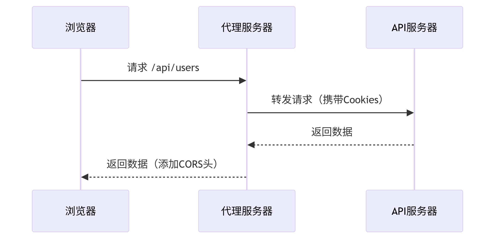
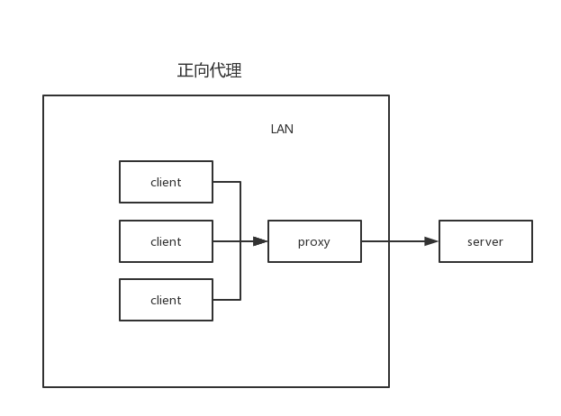
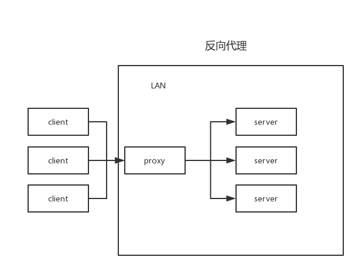

# 前端开发中的代理服务器实践

## 背景

在从0到1搭建插件项目脚手架的过程中，跨域问题是前端开发者常遇到的挑战之一。  
本文将通过实践案例，深入探讨代理服务器在前端开发中的应用，并分享解决跨域问题的系统方法。

## 同源策略（Same-Origin Policy, SOP）

同源策略是浏览器的一个重要安全策略，它规定了不同源之间的文档或脚本在交互时需要遵循的规则。同源策略的核心是源的定义，源由协议、主机和端口三部分组成。只有当两个源的协议、主机和端口完全相同时，它们才被认为是同源的，否则就是跨源或跨域。  

* 作用：同源策略的主要作用是防止恶意网站窃取用户数据。例如，假设用户登录了一个银行网站，然后又打开了一个恶意网站。如果没有同源策略，恶意网站就可以通过脚本访问银行网站的页面内容，从而窃取用户的敏感信息。同源策略限制了不同源之间的文档或脚本的交互，从而保护了用户的安全。

## 跨域的概念解释

跨域问题通常是由浏览器的同源策略引起的访问问题。
同源策略是浏览器的⼀个重要安全机制，它⽤于限制⼀个来源的⽂档或脚本如何能够与另⼀个来源的资源进⾏交互。
同源策略的定义：同源策略要求两个URL必须满⾜以下三个条件才能认为是同源

* 协议（Protocol）：例如，http和https是不同的协议。
* 主机（Host）：例如， www.example.com 和 api.example.com 是不同的主机。
* 端⼝（Port）：例如，默认的8080和8081端⼝被认为是不同的端⼝。

只有当两个URL的协议、主机和端⼝都相同时，才被认为是同源。否则，浏览器会认为它们是跨域的。

### 为什么会产⽣跨域，一定会产生吗？

跨域问题的产⽣和前后端分离的发展密切相关。
在早期，服务器端渲染的应⽤通常不会有跨域问题，因为前端代码和后端API都是在同⼀个服务器上运⾏的。
随着前后端分离的出现，前端代码和后端API经常部署在不同的服务器上，这就引发了跨域问题。
例如，⼀个⽹站的静态资源（HTML、CSS、JavaScript）可能部署在 www.example.com 上，⽽API接⼝则部署在api.example.com 上。
浏览器在发现静态资源和API接⼝不在同⼀个源时，就会产⽣跨域问题。
所以，在静态资源服务器和API服务器（其他资源类同）是同⼀台服务器时，是没有跨域问题的。

## 跨域问题解决方案

## 常见解决方案

### 本地开发环境

我们学习这些东西主要是要学思想，'一法通，万法通'。
想要在本地开发时避开浏览器的同源策略，实现跨域访问，那么就得增加一层代理。因为前端是不能直接访问服务器的，会被限制。但是服务器是可以访问服务器的。

  

tip:Webpack、Vite本地起的开发服务，其实就是用的这个代理架构。

```typescript  
/**
 * 这是基于esbuild.dev.ts的配置
 * 我们用http.createServer起了本地服务器，当匹配到/api前缀的请求时，
 * 利用中间件createProxyMiddleware转发，最终成功调用API服务器接口。
*/
const esbuild = require('esbuild');
const path = require('path');
const fs = require('fs-extra');
const { createProxyMiddleware } = require('http-proxy-middleware');
const http = require('http');

async function build() {
  // 构建配置
  const buildConfig = {
    entryPoints: ['./src/index.tsx'], // React入口文件
    bundle: true,
    metafile: true,
    outfile: './dist/bundle.js', // 明确指定输出文件
    format: 'iife', // 使用立即执行函数格式
    globalName: 'ExtensionApp', // 全局变量名
    target: ['es2020'],
    sourcemap: true,
    minify: true, // 生产环境启用压缩
    define: {
      'process.env.NODE_ENV': '"production"'
    },
    jsx: 'automatic', // 关键配置：使用现代 JSX 转换
    jsxImportSource: './src/index.tsx',
    jsxFactory: 'React.createElement',
    jsxFragment: 'React.Fragment',
    // 将React标记为外部依赖（因为已通过CDN引入）
    external: ['react', 'react-dom'],
    loader: {
      '.ts': 'tsx',
      '.tsx': 'tsx',
      '.css': 'css'
    },
    // 注入React全局变量
    inject: [path.resolve(__dirname, '../src/react/react-shim.js')],
    // 解决动态 require 问题
    banner: {
      js: `
        window.require = function(module) {
          if (module === 'react/jsx-runtime') {
            return {
              jsx: React.createElement,
              jsxs: React.createElement,
              jsxDEV: React.createElement,
              Fragment: React.Fragment
            };
          }
          throw new Error('Dynamic require of "' + module + '" is not supported');
        };
      `
    }
  };

  try {
    console.log('🔨 开始构建...');

    // 执行esbuild构建
    const result = await esbuild.build(buildConfig);

    if (result.errors.length > 0) {
      console.error('❌ 构建失败:', result.errors);
      return;
    }

    console.log('✅ JS构建完成');

    // 复制HTML模板到dist目录
    const templatePath = path.resolve(__dirname, '../src/template/index.html');
    const distPath = path.resolve(__dirname, '../dist/index.html');

    // 确保dist目录存在
    await fs.ensureDir(path.dirname(distPath));

    // 读取HTML模板
    let htmlContent = await fs.readFile(templatePath, 'utf-8');

    // 在HTML中注入JS引用
    const scriptTag = '<script src="./bundle.js"></script>';

    // 在</body>标签前插入script标签
    htmlContent = htmlContent.replace('</body>', `  ${scriptTag}\n</body>`);

    // 写入到dist目录
    await fs.writeFile(distPath, htmlContent, 'utf-8');

    const ctx = await esbuild.context(buildConfig);

    // 先进行一次初始构建，这会触发HTML插件生成HTML文件
    await ctx.rebuild();
    console.log('✅ 初始构建完成');

    // 环境变量配置
    const SESSION_COOKIE = "xxx";

    let apiProxy;
    try {
      apiProxy = createProxyMiddleware({
        target: 'https://xxxxxx',
        changeOrigin: true,
        secure: false,
        rejectUnauthorized: false,
        pathRewrite: {
          '^/api': '/api'
        },
        onProxyReq: (proxyReq: any, req: any, res: any) => {
          console.log(`🔄 代理请求开始: ${req.method} ${req.url}`);

          // 添加必要的请求头
          // proxyReq.setHeader('Origin', 'xxxxxx');
          // proxyReq.setHeader('Referer', 'xxxxxx');
          // proxyReq.setHeader('x-requested-with', 'XMLHttpRequest');
          proxyReq.setHeader('Cookie', `${SESSION_COOKIE}`);
          // proxyReq.setHeader('Sec-Ch-Ua', '"Not)A;Brand";v="8", "Chromium";v="138", "Google Chrome";v="138"');
          // proxyReq.setHeader('Sec-Ch-Ua-Mobile', '?0');
          // proxyReq.setHeader('Sec-Ch-Ua-Platform', '"Windows"');
          // proxyReq.setHeader('Sec-Fetch-Dest', 'empty');
          // proxyReq.setHeader('Sec-Fetch-Mode', 'cors');
          // proxyReq.setHeader('Sec-Fetch-Site', 'same-origin');
          // proxyReq.setHeader('User-Agent', 'Mozilla/5.0 (Windows NT 10.0; Win64; x64) AppleWebKit/537.36 (KHTML, like Gecko) Chrome/138.0.0.0 Safari/537.36');

          console.log('📤 代理请求头已设置');
        },
        onProxyRes: (proxyReq: any, req: any, res: any) => {
          console.log(`✅ 代理响应: ${req.method} ${req.url} -> ${proxyReq.statusCode}`);

          // 添加CORS头部
          // proxyReq.headers['access-control-allow-credentials'] = 'true';
          // proxyReq.headers['access-control-allow-headers'] = 'Accept,Authorization,Cache-Control,Content-Type,DNT,If-Modified-Since,Keep-Alive,Origin,User-Agent,X-Mx-ReqToken,X-Requested-With,x-xsrf-token,x-csrf-token,secretkey';
          // proxyReq.headers['access-control-allow-methods'] = 'GET,POST,OPTIONS';
          // proxyReq.headers['access-control-allow-origin'] = req.headers.origin || 'xxxxxx';
          // proxyReq.headers['connection'] = 'keep-alive';

          console.log('📥 CORS头已添加');
        },
        onError: (proxyReq: any, req: any, res: any) => {
          console.error(`❌ 代理错误: ${req.method} ${req.url}`, proxyReq.message);
          if (!res.headersSent) {
            res.writeHead(500, { 'Content-Type': 'application/json' });
            res.end(JSON.stringify({ error: '代理服务器错误', details: proxyReq.message }));
          }
        }
      });
      console.log('🛠️ 代理中间件创建成功');
    } catch (proxyError) {
      console.error('❌ 创建代理中间件失败:', proxyError);
      throw proxyError;
    }


    // 创建自定义服务器来处理所有请求
    const PORT = 3000;
    const server = http.createServer((req: any, res: any) => {
      // 1. 记录所有传入请求
      console.log(`🌐 收到请求: ${req.method} ${req.url}`);

      // 2. 处理预检请求
      if (req.method === 'OPTIONS') {
        console.log('🛡️ 处理OPTIONS预检请求');
        res.writeHead(200, {
          'Access-Control-Allow-Origin': req.headers.origin || '*',
          'Access-Control-Allow-Methods': 'GET, POST, PUT, DELETE, OPTIONS',
          'Access-Control-Allow-Headers': 'Accept,Authorization,Cache-Control,Content-Type,DNT,If-Modified-Since,Keep-Alive,Origin,User-Agent,X-Mx-ReqToken,X-Requested-With,x-xsrf-token,x-csrf-token,secretkey',
          'Access-Control-Allow-Credentials': 'true',
          'Content-Length': 0
        });
        res.end();
        return;
      }

      // 2. 处理API请求 - 关键修复：确保所有/api请求都经过代理
      if (req.url && req.url.startsWith('/api')) {
        console.log(`🔁 路由API请求: ${req.url}`);
        try {
          console.log(`黑子说话:  req:${req} res:${res}`);
          // 关键：确保代理中间件被调用
          apiProxy(req, res);
        } catch (handlerError) {
          console.error('❌ 处理API请求时出错:', handlerError);
          if (!res.headersSent) {
            res.writeHead(500, { 'Content-Type': 'application/json' });
            res.end(JSON.stringify({ error: '请求处理失败' }));
          }
        }
        return;
      }

      // 3. 处理API请求 - 增强路由匹配
      if (req.url && req.url.startsWith('/api')) {
        console.log(`🔁 路由匹配: API请求 -> ${req.url}`);

        // 添加请求头日志
        console.log('📤 请求头:');
        Object.keys(req.headers).forEach(key => {
          console.log(`  ${key}: ${req.headers[key]}`);
        });

        // 使用代理处理API请求
        return apiProxy(req, res);
      }

      // 4. 处理静态文件请求
      console.log(`📁 静态文件请求: ${req.url}`);
      const filePath = path.join(__dirname, '../dist', req.url === '/' ? 'index.html' : req.url);

      fs.readFile(filePath, (err: NodeJS.ErrnoException | null, data: Buffer) => {
        if (err) {
          console.log(`❌ 文件未找到: ${filePath}`);
          res.writeHead(404, { 'Content-Type': 'text/plain' });
          res.end('File not found');
          return;
        }

        // 根据文件扩展名设置正确的 Content-Type
        const ext = path.extname(filePath);
        let contentType = 'text/plain';

        switch (ext) {
          case '.html': contentType = 'text/html'; break;
          case '.js': contentType = 'application/javascript'; break;
          case '.css': contentType = 'text/css'; break;
          case '.json': contentType = 'application/json'; break;
          case '.png': contentType = 'image/png'; break;
          case '.jpg': case '.jpeg': contentType = 'image/jpeg'; break;
          case '.svg': contentType = 'image/svg+xml'; break;
        }

        console.log(`📄 提供静态文件: ${filePath} (${contentType})`);
        res.writeHead(200, { 'Content-Type': contentType });
        res.end(data);
      });
    });

    // 启动服务器
    server.listen(PORT, 'localhost', () => {
      console.log(`🚀 开发服务器已启动: http://localhost:${PORT}`);
    });

    await ctx.watch();
    console.log('👀 文件监听已启动，自动重新构建...');

  } catch (error) {
    console.error('❌ 构建过程中发生错误:', error);
  }
}

// 如果直接运行此文件，则执行构建
if (require.main === module) {
  build().catch(console.error);
}

module.exports = { build }; 
```

### 正式环境

#### 方案一： 静态资源和API服务器部署在同一个服务器中

CORS是一种现代的解决跨域问题的方法。它允许服务器在响应头中添加Access-Control-Allow-Origin字段，从而允许特定的跨域请求。例如，如果<http://api.example.com服务器在响应头中添加了Access-Control-Allow-Origin:> <http://www.example.com字段，那么http://www.example.com就可以通过AJAX请求访问http://api.example.com上的资源>。

#### 方案二： CORS，跨域资源共享

CORS，全称为“跨域资源共享”（Cross-Origin Resource Sharing），是一种机制，它使用额外的 HTTP 头来告诉浏览器允许一个网页从另一个域（不同于该网页所在的域）请求资源。这样可以在服务器和客户端之间进行安全的跨域通信。

当一个网页向不同源发出请求时，CORS 会通过以下几个步骤来处理：

预检请求（Preflight Request）：对于某些类型的请求（如使用 HTTP 方法 PUT、DELETE，或者请求带有非简单头部），浏览器会首先发送一个 OPTIONS 请求，这个请求称为“预检请求”。服务器收到这个请求后，会返回一个响应头部，指明实际请求是否被允许。

实际请求（Actual Request）：如果预检请求通过，浏览器会继续发送实际的请求。

响应头部（Response Headers）：服务器在响应中会包含一些特定的 CORS 头部，如 Access-Control-Allow-Origin，以指示哪些域名可以访问资源。

CORS 工作流程
CORS 通过在 HTTP(s) 请求和响应中使用特定的头部字段来实现跨域资源共享，具体来说，CORS 分为两种类型的请求处理方式：简单请求和预检请求。

* 简单请求：对于某些简单的 HTTP 请求（如GET、POST请求且不包含自定义头部），浏览器会直接发送请求，并在响应中检查 CORS 头部。

* 预检请求：对于复杂请求（如使用PUT、DELETE方法，或包含自定义头部），浏览器会首先发送一个OPTIONS请求，称为预检请求（Preflight Request），以确定服务器是否允许实际请求。

简单请求
简单请求是指满足以下条件的 HTTP 请求：
使用GET、POST、HEAD方法
请求头部仅包含以下字段：Accept、Accept-Language、Content-Language、Content-Type（且值为application/x-www-form-urlencoded、multipart/form-data或text/plain）
对于简单请求，浏览器会直接发送请求并在响应中检查以下 CORS 头部：

Access-Control-Allow-Origin：指示允许访问资源的源。
Access-Control-Allow-Credentials：指示是否允许发送凭据（如Cookies）。
Access-Control-Expose-Headers：指示哪些头部可以作为响应的一部分被访问。

预检请求
对于复杂请求，浏览器会首先发送一个 OPTIONS 请求，包含以下头部字段：
Origin：指示请求的源。
Access-Control-Request-Method：指示实际请求将使用的方法。
Access-Control-Request-Headers：指示实际请求将包含的自定义头部。
服务器收到预检请求后，会返回一个响应，包含以下头部字段以指示是否允许请求：
Access-Control-Allow-Origin：表明允许访问资源的源，可以是具体的源或通配符 *；
Access-Control-Allow-Methods：表明允许的方法，如 GET, POST, PUT, DELETE；
Access-Control-Allow-Headers：表明允许的自定义头部；
Access-Control-Allow-Credentials：表明是否允许发送凭据（如 Cookies）；
Access-Control-Expose-Headers：表明哪些头部可以作为响应的一部分被访问；
Access-Control-Max-Age：表明预检请求的结果可以被缓存的时间，单位是秒；

如果预检请求通过，浏览器会继续发送实际请求。

#### 方案三： Ngix反向代理

##### 先谈谈什么是正向/反向代理

1. 正向代理
正向代理，意思是一个位于客户端和原始服务器(origin server)之间的服务器，为了从原始服务器取得内容，客户端向代理发送一个请求并指定目标(原始服务器)，然后代理向原始服务器转交请求并将获得的内容返回给客户端。
  

2. 反向代理
反向代理（Reverse Proxy）方式是指以代理服务器来接受internet上的连接请求，然后将请求转发给内部网络上的服务器，并将从服务器上得到的结果返回给internet上请求连接的客户端，此时代理服务器对外就表现为一个反向代理服务器。
  

tips：
正向代理即是客户端代理, 代理客户端, 服务端不知道实际发起请求的客户端。
反向代理即是服务端代理, 代理服务端, 客户端不知道实际提供服务的服务端。

例：

* 正向代理：
我想去买小明水果，但是我自己懒得去买，我通过一个中介的去帮我跑腿买，即是正向代理，小明水果并不需要知道，我来买水果了。

* 反向代理：
而在反向代理中，我想吃苹果，我还是懒得去买，但是我和中介说，我想吃苹果，我不关心吃什么苹果，你只要给我拿到一个苹果。

##### 正向代理的作用

为在防火墙内的局域网客户端提供访问Internet的途径
可以使用缓冲特性减少网络使用率
访问受地理位置限制的网络
使用代理后会隐藏真实的IP地址

##### 反向代理可实现的功能

反向代理的主要作用是提供负载均衡和高可用性。
负载均衡：Nginx可以将传入的请求分发给多个后端服务器，以平衡服务器的负载，提高系统性能和可靠性。
缓存功能：Nginx可以缓存静态文件或动态页面，减轻服务器的负载，提高响应速度。
动静分离：将动态生成的内容（如 PHP、Python、Node.js 等）和静态资源（如 HTML、CSS、JavaScript、图片、视频等）分别存放在不同的服务器或路径上。
多站点代理：Nginx可以代理多个域名或虚拟主机，将不同的请求转发到不同的后端服务器上，实现多个站点的共享端口。

## 不常见解决方案

1. jsonp
JSONP是一种古老的解决跨域问题的方法。它通过动态创建script标签来加载跨域资源。JSONP的工作原理是，服务器返回一个JavaScript函数调用，客户端通过动态创建script标签来加载这个函数调用。由于script标签不受同源策略的限制，因此可以实现跨域请求。
然而，JSONP有一些缺点。首先，JSONP只能实现GET请求，不能实现POST请求。其次，JSONP的安全性较低，容易受到XSS攻击。因此，在现代Web开发中，JSONP已经逐渐被CORS和代理所取代。
2. postMessage
3. websocket
