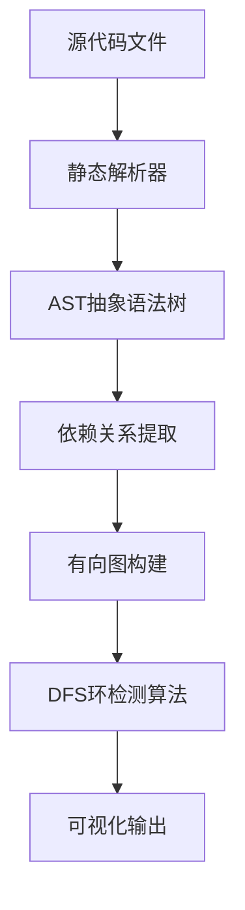

# 前端项目循环引用与 Worker 环境污染完全解决指南

> 大型前端项目的"隐形杀手"：循环引用导致运行时变量为 undefined，Worker 环境限制让工具类库因 DOM 引用而崩溃

## 📚 课程目录

1. [问题本质与危害](#问题本质与危害)
2. [循环引用深度解析](#循环引用深度解析)
3. [Worker 环境污染机制](#worker环境污染机制)
4. [检测工具原理与对比](#检测工具原理与对比)
5. [解决方案最佳实践](#解决方案最佳实践)
6. [架构设计防范策略](#架构设计防范策略)
7. [CI/CD 集成与自动化](#cicd集成与自动化)

---

## 问题本质与危害

### 🎯 什么是循环引用？

循环引用是指模块 A 引用模块 B，而模块 B 又直接或间接引用模块 A，形成一个闭环依赖关系。

**危害表现：**

- 运行时变量为`undefined`
- 模块初始化顺序混乱
- 打包工具警告或错误
- 代码逻辑不可预测

### 🎯 什么是 Worker 环境污染？

Worker 环境污染是指在 Web Worker 中意外引入了浏览器特有的 API（如`window`、`document`、`navigator`），导致 Worker 崩溃。

**危害表现：**

- Worker 启动失败
- 运行时抛出`ReferenceError`
- 难以追溯错误源头
- 影响多线程性能优化

### 💡 为什么这些问题特别难调试？

1. **错误发生在深层调用栈**：问题往往不在直接引用的地方
2. **编译时不报错**：只有运行时才暴露问题
3. **依赖链复杂**：大型项目中依赖关系错综复杂
4. **间接引用**：通过多层依赖间接引入问题代码

---

## 循环引用深度解析

### 🔍 循环引用的形成机制

#### 直接循环引用

```typescript
// moduleA.ts
import { nameB } from "./moduleB";
export const nameA = "Module A";
console.log("In A, nameB is:", nameB); // undefined!

// moduleB.ts
import { nameA } from "./moduleA";
export const nameB = "Module B";
console.log("In B, nameA is:", nameA); // undefined!
```

#### 间接循环引用

```typescript
// A.ts -> B.ts -> C.ts -> A.ts
// A.ts
import { funcB } from "./B";
export const funcA = () => funcB();

// B.ts
import { funcC } from "./C";
export const funcB = () => funcC();

// C.ts
import { funcA } from "./A"; // 形成环！
export const funcC = () => funcA();
```

### 🧠 JavaScript 模块加载机制

**ES6 模块加载过程：**

1. **解析阶段**：构建模块依赖图
2. **实例化阶段**：为每个模块创建模块记录
3. **求值阶段**：执行模块代码

**循环引用时的执行顺序：**

```javascript
// 当A引用B，B引用A时：
// 1. 开始加载A
// 2. A需要B，开始加载B
// 3. B需要A，但A还在加载中
// 4. B获得A的未完成版本（部分导出为undefined）
// 5. B完成加载
// 6. A完成加载
```

### 📊 循环引用的类型分析

| 类型     | 描述                | 危害程度 | 示例场景           |
| -------- | ------------------- | -------- | ------------------ |
| 值循环   | 导出值相互引用      | 🔴 高    | 常量、配置对象     |
| 函数循环 | 函数相互调用        | 🟡 中    | 工具函数、业务逻辑 |
| 类型循环 | TypeScript 类型引用 | 🟢 低    | 接口定义、类型声明 |
| 类循环   | 类实例相互依赖      | 🔴 高    | 业务模型、服务类   |

---

## Worker 环境污染机制

### 🌐 Web Worker 环境特点

**Worker 环境限制：**

- 无法访问 DOM（`document`、`window`）
- 无法访问父页面对象
- 无法访问某些浏览器 API
- 只能通过`postMessage`通信

**可用的全局对象：**

```javascript
// ✅ Worker中可用
self; // Worker全局对象
console; // 控制台输出
setTimeout; // 定时器
fetch; // 网络请求
WebSocket; // WebSocket连接
IndexedDB; // 本地数据库

// ❌ Worker中不可用
window; // 浏览器窗口对象
document; // DOM文档对象
navigator; // 浏览器信息（部分可用）
localStorage; // 本地存储
```

### 🕸️ 污染传播链路分析

#### 典型污染场景

```typescript
// 😈 污染源：domUtils.ts
export const getUrl = () => {
  return window.location.href; // 💣 炸弹！
};
export const formatString = (str: string) => `Result: ${str}`;

// 😇 无辜的中间层：processor.ts
import { formatString } from "./domUtils"; // 😱 意外引入污染
export const processData = (data: any) => {
  return formatString(JSON.stringify(data));
};

// 🎯 Worker入口：main.worker.ts
import { processData } from "./processor"; // 💥 Worker崩溃！
self.onmessage = (e) => {
  const result = processData(e.data);
  self.postMessage(result);
};
```

#### 污染检测难点

1. **静态分析困难**：需要深度遍历依赖树
2. **动态引入**：`import()`语句难以静态检测
3. **第三方库**：npm 包可能包含浏览器特定代码
4. **条件引用**：基于环境的条件导入

---

## 检测工具原理与对比

### 🔧 Madge：可视化依赖分析专家

#### 工作原理



#### 核心算法：深度优先搜索（DFS）

```javascript
// Madge环检测伪代码
function detectCycles(graph) {
  const visited = new Set();
  const recursionStack = new Set();
  const cycles = [];

  function dfs(node, path) {
    if (recursionStack.has(node)) {
      // 发现环！
      const cycleStart = path.indexOf(node);
      cycles.push(path.slice(cycleStart));
      return;
    }

    if (visited.has(node)) return;

    visited.add(node);
    recursionStack.add(node);
    path.push(node);

    for (const neighbor of graph[node] || []) {
      dfs(neighbor, [...path]);
    }

    recursionStack.delete(node);
  }

  return cycles;
}
```

#### 使用示例

```bash
# 基础检测
npx madge --circular src/

# 生成可视化图表
npx madge --circular --image deps.svg src/

# 排除特定目录
npx madge --circular --exclude 'node_modules|test' src/

# 指定文件扩展名
npx madge --circular --extensions ts,tsx src/
```

### ⚡ DPDM：高性能 TypeScript 专家

#### 性能优势分析

**为什么 DPDM 更快？**

1. **直接使用 TypeScript Compiler API**

```typescript
// Madge的解析链路
TypeScript → 转换器 → detective → dependency-tree → Madge

// DPDM的解析链路
TypeScript → TypeScript Compiler API → DPDM
```

2. **异步并行处理**

```javascript
// DPDM并发处理伪代码
async function analyzeFiles(files) {
  const chunks = chunkArray(files, CPU_CORES);
  const results = await Promise.all(
    chunks.map((chunk) => Promise.all(chunk.map((file) => parseFile(file))))
  );
  return results.flat();
}
```

3. **类型引用过滤**

```bash
# 忽略类型引用（关键功能！）
dpdm --circular --ignore-type-dependencies src/**/*.ts
```

#### 工具对比表

| 特性                | Madge     | DPDM          | 推荐场景         |
| ------------------- | --------- | ------------- | ---------------- |
| **解析速度**        | 🟡 中等   | 🟢 极快       | 大型项目选 DPDM  |
| **TypeScript 支持** | 🟡 需配置 | 🟢 原生支持   | TS 项目选 DPDM   |
| **可视化**          | 🟢 优秀   | 🟡 基础       | 演示选 Madge     |
| **类型过滤**        | ❌ 不支持 | ✅ 支持       | 复杂类型选 DPDM  |
| **多格式支持**      | 🟢 广泛   | 🟡 专注 JS/TS | 多技术栈选 Madge |
| **CI/CD 集成**      | 🟡 可用   | 🟢 优秀       | 自动化选 DPDM    |

### 🛠️ Dependency Cruiser：架构规则守护者

```javascript
// .dependency-cruiser.js
module.exports = {
  forbidden: [
    {
      name: "no-worker-dom-pollution",
      comment: "禁止Worker目录引用DOM相关模块",
      severity: "error",
      from: { path: "src/worker" },
      to: {
        path: "src/ui|react|antd|@ant-design",
        pathNot: "src/shared",
      },
    },
    {
      name: "no-circular",
      comment: "禁止循环引用",
      severity: "warn",
      from: {},
      to: { circular: true },
    },
  ],
};
```

---

## 解决方案最佳实践

### 🔄 循环引用解决方案

#### 方案一：第三模块法则（The Third Module Rule）

**问题场景：**

```typescript
// ❌ 循环引用
// userService.ts
import { validateUser } from "./userValidator";
export class UserService {
  createUser(data) {
    if (validateUser(data)) {
      // 创建用户逻辑
    }
  }
}

// userValidator.ts
import { UserService } from "./userService";
export function validateUser(data) {
  const service = new UserService(); // 💥 循环引用！
  return service.checkDuplicate(data);
}
```

**解决方案：**

```typescript
// ✅ 提取共享模块
// shared/userTypes.ts
export interface User {
  id: string;
  name: string;
}

export interface UserRepository {
  findByEmail(email: string): Promise<User | null>;
}

// userService.ts
import { User, UserRepository } from "./shared/userTypes";
import { validateUser } from "./userValidator";

export class UserService {
  constructor(private repo: UserRepository) {}

  createUser(data: User) {
    if (validateUser(data, this.repo)) {
      return this.repo.save(data);
    }
  }
}

// userValidator.ts
import { User, UserRepository } from "./shared/userTypes";

export function validateUser(data: User, repo: UserRepository) {
  return repo.findByEmail(data.email).then((user) => !user);
}
```

#### 方案二：懒加载（Lazy Loading）

```typescript
// ❌ 静态导入导致循环引用
import { heavyModule } from "./heavy";

export function lightFunction() {
  return heavyModule.process();
}

// ✅ 动态导入避免循环引用
export async function lightFunction() {
  const { heavyModule } = await import("./heavy");
  return heavyModule.process();
}
```

#### 方案三：依赖倒置（Dependency Inversion）

```typescript
// ✅ 使用事件系统解耦
// eventBus.ts
class EventBus {
  private listeners = new Map();

  on(event: string, callback: Function) {
    if (!this.listeners.has(event)) {
      this.listeners.set(event, []);
    }
    this.listeners.get(event).push(callback);
  }

  emit(event: string, data: any) {
    const callbacks = this.listeners.get(event) || [];
    callbacks.forEach((cb) => cb(data));
  }
}

export const eventBus = new EventBus();

// moduleA.ts
import { eventBus } from "./eventBus";

export function moduleAFunction() {
  eventBus.emit("moduleA:action", { data: "from A" });
}

// moduleB.ts
import { eventBus } from "./eventBus";

eventBus.on("moduleA:action", (data) => {
  console.log("Module B received:", data);
});
```

### 🧹 Worker 环境污染解决方案

#### 方案一：严格目录隔离（Tiered Architecture）

```
project/
├── src/
│   ├── shared/          # 同构代码（Isomorphic）
│   │   ├── utils/       # 纯函数工具
│   │   ├── types/       # 类型定义
│   │   └── constants/   # 常量定义
│   ├── ui/              # 浏览器专用
│   │   ├── components/  # React组件
│   │   └── hooks/       # 浏览器Hooks
│   └── worker/          # Worker专用
│       ├── processors/  # 数据处理
│       └── algorithms/  # 算法实现
```

**架构规则：**

- `shared/` 严禁引用 `ui/` 或 `worker/`
- `ui/` 可以引用 `shared/`
- `worker/` 只能引用 `shared/`

#### 方案二：环境检测包装

```typescript
// shared/safeUtils.ts
export const createSafeUtils = () => {
  const isWorker = typeof window === "undefined";
  const isBrowser = typeof window !== "undefined";

  return {
    getUrl: () => {
      if (isBrowser) {
        return window.location.href;
      }
      return "worker-environment";
    },

    storage: {
      get: (key: string) => {
        if (isBrowser && localStorage) {
          return localStorage.getItem(key);
        }
        return null;
      },
      set: (key: string, value: string) => {
        if (isBrowser && localStorage) {
          localStorage.setItem(key, value);
        }
      }
    },
    
    // 使用globalThis确保跨环境兼容
    global: globalThis
  };
};

export const safeUtils = createSafeUtils();
```

#### 方案三：构建时替换（Build-time Substitution）

```javascript
// vite.config.js
export default {
  define: {
    __IS_WORKER__: JSON.stringify(process.env.BUILD_TARGET === 'worker')
  },
  resolve: {
    alias: {
      // Worker构建时替换DOM工具
      '@/utils/dom': process.env.BUILD_TARGET === 'worker' 
        ? '@/utils/dom.worker.ts'
        : '@/utils/dom.browser.ts'
    }
  }
};

// utils/dom.browser.ts
export const getViewport = () => ({
  width: window.innerWidth,
  height: window.innerHeight
});

// utils/dom.worker.ts  
export const getViewport = () => ({
  width: 1920, // 默认值
  height: 1080
});
```

---

## 架构设计防范策略

### 🏗️ 分层架构设计

#### 洋葱架构（Onion Architecture）

```typescript
// 核心层：纯业务逻辑
// core/entities/User.ts
export class User {
  constructor(
    public readonly id: string,
    public readonly email: string
  ) {}
  
  isValid(): boolean {
    return this.email.includes('@');
  }
}

// 应用层：用例编排
// core/usecases/CreateUser.ts
import { User } from '../entities/User';
import { UserRepository } from '../interfaces/UserRepository';

export class CreateUserUseCase {
  constructor(private userRepo: UserRepository) {}
  
  async execute(email: string): Promise<User> {
    const user = new User(generateId(), email);
    if (!user.isValid()) {
      throw new Error('Invalid user');
    }
    return this.userRepo.save(user);
  }
}

// 接口层：抽象定义
// core/interfaces/UserRepository.ts
import { User } from '../entities/User';

export interface UserRepository {
  save(user: User): Promise<User>;
  findById(id: string): Promise<User | null>;
}

// 基础设施层：具体实现
// infrastructure/HttpUserRepository.ts
import { UserRepository } from '../core/interfaces/UserRepository';

export class HttpUserRepository implements UserRepository {
  async save(user: User): Promise<User> {
    // HTTP请求实现
    const response = await fetch('/api/users', {
      method: 'POST',
      body: JSON.stringify(user)
    });
    return response.json();
  }
}

// infrastructure/WorkerUserRepository.ts
export class WorkerUserRepository implements UserRepository {
  async save(user: User): Promise<User> {
    // Worker环境实现（可能使用IndexedDB）
    return user; // 简化实现
  }
}
```

### 📋 ESLint规则配置

```javascript
// .eslintrc.js
module.exports = {
  plugins: ['import'],
  rules: {
    // 禁止循环引用
    'import/no-cycle': ['error', { 
      maxDepth: 10,
      ignoreExternal: true 
    }],
    
    // 禁止自引用
    'import/no-self-import': 'error',
    
    // 强制导入顺序
    'import/order': ['error', {
      'groups': [
        'builtin',   // Node.js内置模块
        'external',  // npm包
        'internal',  // 内部模块
        'parent',    // 父级目录
        'sibling',   // 同级目录
        'index'      // index文件
      ],
      'newlines-between': 'always'
    }]
  },
  
  // Worker环境特殊规则
  overrides: [
    {
      files: ['src/worker/**/*.ts'],
      env: {
        browser: false,
        worker: true
      },
      rules: {
        // 禁止在Worker中使用浏览器API
        'no-restricted-globals': [
          'error',
          'window',
          'document',
          'localStorage',
          'sessionStorage'
        ]
      }
    }
  ]
};
```

---

## CI/CD集成与自动化

### 🚀 GitHub Actions工作流

```yaml
# .github/workflows/dependency-check.yml
name: 依赖关系检查

on:
  push:
    branches: [ main, develop ]
  pull_request:
    branches: [ main ]

jobs:
  dependency-check:
    runs-on: ubuntu-latest
    
    steps:
    - name: 检出代码
      uses: actions/checkout@v3
      
    - name: 设置Node.js
      uses: actions/setup-node@v3
      with:
        node-version: '18'
        cache: 'npm'
        
    - name: 安装依赖
      run: npm ci
      
    - name: ESLint检查
      run: npm run lint
      
    - name: 循环引用检测（快速）
      run: npx dpdm --circular --exit-code 1 src/**/*.ts
      
    - name: 架构规则检查
      run: npx dependency-cruiser --validate .dependency-cruiser.js src
      
    - name: 生成依赖报告
      if: failure()
      run: |
        npx madge --circular --image deps-circular.svg src/
        npx dpdm --circular --output deps-report.json src/**/*.ts
        
    - name: 上传报告
      if: failure()
      uses: actions/upload-artifact@v3
      with:
        name: dependency-reports
        path: |
          deps-circular.svg
          deps-report.json
```

### 📊 自动化报告生成

```javascript
// scripts/generate-dependency-report.js
const madge = require('madge');
const fs = require('fs');
const path = require('path');

async function generateReport() {
  try {
    // 分析依赖关系
    const res = await madge('src/', {
      fileExtensions: ['ts', 'tsx'],
      excludeRegExp: /node_modules/
    });
    
    // 检测循环引用
    const circular = res.circular();
    
    // 生成统计信息
    const stats = {
      totalFiles: res.obj().length,
      circularDependencies: circular.length,
      timestamp: new Date().toISOString(),
      details: circular
    };
    
    // 保存报告
    fs.writeFileSync(
      'reports/dependency-report.json',
      JSON.stringify(stats, null, 2)
    );
    
    // 生成可视化图表
    if (circular.length > 0) {
      await res.image('reports/circular-deps.svg');
    }
    
    console.log(`✅ 报告已生成: ${circular.length} 个循环引用`);
    
    // 如果有循环引用，退出码为1
    process.exit(circular.length > 0 ? 1 : 0);
    
  } catch (error) {
    console.error('❌ 生成报告失败:', error);
    process.exit(1);
  }
}

generateReport();
```

### 🔧 Pre-commit钩子

```json
// package.json
{
  "husky": {
    "hooks": {
      "pre-commit": "lint-staged"
    }
  },
  "lint-staged": {
    "src/**/*.{ts,tsx}": [
      "eslint --fix",
      "dpdm --circular --exit-code 1"
    ]
  }
}
```

---

## 🎯 总结与最佳实践清单

### ✅ 循环引用预防清单

- [ ] **设计阶段**：明确模块职责边界
- [ ] **编码阶段**：遵循单向依赖原则
- [ ] **审查阶段**：关注import语句方向
- [ ] **测试阶段**：集成依赖检测工具
- [ ] **部署阶段**：CI/CD自动化检查

### ✅ Worker污染预防清单

- [ ] **架构设计**：严格目录分层
- [ ] **代码编写**：使用环境检测
- [ ] **工具配置**：ESLint规则限制
- [ ] **构建优化**：环境特定打包
- [ ] **测试验证**：多环境测试覆盖

### 🛠️ 推荐工具组合

**小型项目（<100个文件）：**
- Madge + ESLint import插件

**中型项目（100-500个文件）：**
- DPDM + Dependency Cruiser + GitHub Actions

**大型项目（>500个文件）：**
- DPDM + Dependency Cruiser + 自定义检测脚本 + 完整CI/CD流程

### 🎓 进阶学习资源

1. **图论算法**：深入理解环检测算法
2. **模块系统**：ES6、CommonJS、AMD模块机制
3. **Web Worker API**：掌握多线程编程
4. **静态分析**：AST解析与代码分析技术
5. **架构设计**：领域驱动设计（DDD）原则

---

> 💡 **记住**：预防胜于治疗。通过合理的架构设计和自动化工具，可以在问题发生之前就将其扼杀在摇篮里。循环引用和Worker污染虽然是"隐形杀手"，但只要掌握了正确的方法，它们就无所遁形！

1. **图论算法**：深入理解环检测算法
2. **模块系统**：ES6、CommonJS、AMD 模块机制
3. **Web Worker API**：掌握多线程编程
4. **静态分析**：AST 解析与代码分析技术
5. **架构设计**：领域驱动设计（DDD）原则

---

> 💡 **记住**：预防胜于治疗。通过合理的架构设计和自动化工具，可以在问题发生之前就将其扼杀在摇篮里。循环引用和 Worker 污染虽然是"隐形杀手"，但只要掌握了正确的方法，它们就无所遁形！

## 问题复现

### 项目结构

```
problem-demo/
├── src/
│   ├── circular/
│   │   ├── moduleA.ts  ← 引入 moduleB
│   │   └── moduleB.ts  ← 引入 moduleA
│   └── worker/
│       ├── main.worker.ts  ← 引入 processor
│       ├── processor.ts    ← 引入 domUtils
│       └── domUtils.ts     ← 使用 window.location
└── package.json
```

### 循环引用代码

**moduleA.ts**

```typescript
import { nameB } from "./moduleB";

export const nameA = "Module A";

console.log("In A, nameB is:", nameB);
```

**moduleB.ts**

```typescript
import { nameA } from "./moduleA";

export const nameB = "Module B";

console.log("In B, nameA is:", nameA);
```

### Worker 环境污染代码

**domUtils.ts**

```typescript
// 这个文件操作了浏览器特有的对象
export const getUrl = () => {
  return window.location.href; // ❌ Worker 环境没有 window，会报错
};

export const formatString = (str: string) => `Result: ${str}`;
```

**processor.ts**

```typescript
import { formatString } from "./domUtils"; // 😱 不小心引入了包含污染的文件

export const processData = (data: any) => {
  return formatString(JSON.stringify(data));
};
```

**main.worker.ts**

```typescript
import { processData } from "./processor";

self.onmessage = (e) => {
  const result = processData(e.data);
  self.postMessage(result);
};
```

## 工具检测

### 配置检测工具

**package.json**

```json
{
  "scripts": {
    "madge": "madge --circular --extensions ts ./src",
    "dpdm": "dpdm --circular ./src/**/*.ts"
  },
  "devDependencies": {
    "madge": "^6.1.0",
    "dpdm": "^3.14.0",
    "typescript": "^5.0.0"
  }
}
```

### Madge 分析结果

```bash
$ npm run madge

✖ Found 1 circular dependency!

1) circular/moduleA.ts > circular/moduleB.ts
```

### DPDM 分析结果

```bash
$ npm run dpdm

• Dependencies Tree
  - 0) src\worker\processor.ts
  ·   - 1) src\worker\domUtils.ts
  - 2) src\worker\main.worker.ts
  ·   - 3) src\worker\processor.ts
  - 1) src\worker\domUtils.ts
  - 4) src\circular\moduleB.ts
  ·   - 5) src\circular\moduleA.ts
  ·       - 4) src\circular\moduleB.ts

• Circular Dependencies
  1) src\circular\moduleB.ts -> src\circular\moduleA.ts
```

## 解决方案

### 1. 循环引用解决

**方案一：提取共享接口**

```typescript
// shared.ts
export interface ModuleInterface {
  name: string;
}

// moduleA.ts (修复后)
import { ModuleInterface } from "./shared";
export const nameA: ModuleInterface = { name: "Module A" };

// moduleB.ts (修复后)
import { ModuleInterface } from "./shared";
export const nameB: ModuleInterface = { name: "Module B" };
```

**方案二：依赖注入**

```typescript
// moduleA.ts
export const createModuleA = (moduleB: any) => {
  return {
    name: "Module A",
    getOtherModule: () => moduleB,
  };
};
```

### 2. Worker 环境污染解决

**创建纯净工具函数**

```typescript
// pureUtils.ts (DOM-free)
export const formatString = (str: string) => `Result: ${str}`;

// processor.ts (修复后)
import { formatString } from "./pureUtils"; // ✅ 使用纯净版本

export const processData = (data: any) => {
  return formatString(JSON.stringify(data));
};
```

**环境检测包装**

```typescript
// safeUtils.ts
export const getUrl = () => {
  if (typeof window !== "undefined") {
    return window.location.href;
  }
  return "worker-environment";
};
```

## 最佳实践

### 预防循环引用

1. **设计阶段**：明确模块职责，避免相互依赖
2. **代码审查**：关注 import 语句的方向性
3. **工具检测**：集成到 CI/CD 流程中

### 预防 Worker 污染

1. **分离关注点**：Worker 相关代码独立目录
2. **环境检测**：使用 typeof 检查全局对象
3. **纯函数设计**：Worker 中只使用纯数据处理函数

### CI/CD 集成

```yaml
# .github/workflows/dependency-check.yml
name: Dependency Check
on: [push, pull_request]
jobs:
  check:
    runs-on: ubuntu-latest
    steps:
      - uses: actions/checkout@v2
      - name: Install dependencies
        run: npm install
      - name: Check circular dependencies
        run: npm run madge
      - name: Analyze dependencies
        run: npm run dpdm
```

## 工具对比

| 工具  | 优势                 | 劣势         | 适用场景         |
| ----- | -------------------- | ------------ | ---------------- |
| Madge | 简洁输出，易于理解   | 功能相对简单 | 快速检测循环引用 |
| DPDM  | 详细依赖树，功能丰富 | 输出较复杂   | 深度分析项目结构 |

## 总结

循环引用和 Worker 环境污染是前端项目中的隐蔽问题，通过：

1. **工具检测**：Madge/DPDM 自动发现问题
2. **架构设计**：合理的模块划分和依赖关系
3. **代码规范**：环境检测和纯函数设计

可以有效预防和解决这类问题，提升项目的稳定性和可维护性。
