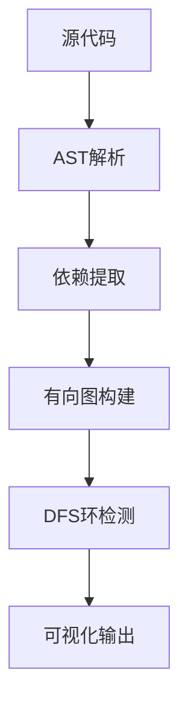

# 前端项目循环引用与 Worker 环境污染完全解决指南

> 大型前端项目的“隐形杀手”：循环引用导致运行时变量为 `undefined`，Worker 环境限制让工具类库因 DOM 引用而崩溃。

## 📚 课程目录

1. [问题本质与危害](#问题本质与危害)
2. [循环引用深度解析](#循环引用深度解析)
3. [Worker 环境污染机制](#worker环境污染机制)
4. [检测工具原理与对比](#检测工具原理与对比)
5. [解决方案最佳实践](#解决方案最佳实践)
6. [架构设计防范策略](#架构设计防范策略)
7. [CI/CD 集成与自动化](#cicd集成与自动化)

---

## 问题本质与危害

### 🎯 什么是循环引用？

当模块 A 引用模块 B，而模块 B 又直接或间接引用模块 A 时，形成闭环依赖。

**危害表现：**

- 运行时变量为 `undefined`
- 模块初始化顺序混乱
- 打包工具警告或执行异常

### 🎯 什么是 Worker 环境污染？

在 Web Worker 中意外引入了浏览器特有的 API（如 `window`、`document`、`navigator`），导致环境崩溃。

**危害表现：**

- Worker 启动失败并抛出 `ReferenceError`
- 难以通过简单的堆栈追溯错误源头

---

## 循环引用深度解析

### 🔍 形成机制与模块加载

在 ES6 模块求值阶段，若 A 引用 B 且 B 引用 A，B 会获得 A 的“未完成版本”（部分导出可能为 `undefined`）。

#### 常见场景：

```typescript
// moduleA.ts
import { nameB } from "./moduleB";
export const nameA = "Module A";
console.log(nameB); // 可能为 undefined

// moduleB.ts
import { nameA } from "./moduleA";
export const nameB = "Module B";
```

### 📊 循环引用的类型分析

| 类型     | 描述                | 危害程度 | 示例场景           |
| :------- | :------------------ | :------- | :----------------- |
| 值循环   | 导出值相互引用      | 🔴 高    | 常量、配置对象     |
| 函数循环 | 函数相互调用        | 🟡 中    | 工具函数、业务逻辑 |
| 类型循环 | TypeScript 类型引用 | 🟢 低    | `import type` 声明 |

---

## Worker 环境污染机制

### 🌐 Web Worker 环境特点

Worker 运行在独立线程中，没有 DOM 环境。

**可用性清单：**

- **✅ 可用**：`self`, `console`, `fetch`, `IndexedDB`, `globalThis`
- **❌ 不可用**：`window`, `document`, `localStorage`, `sessionStorage`

### 🕸️ 污染传播链路

污染通常通过隐蔽的依赖链传播：
`main.worker.ts` → `processor.ts` → `domUtils.ts` (内含 `window.location`) 💣

---

## 检测工具原理与对比

### 🔧 Madge：可视化分析专家

**原理**：基于 `dependency-tree` 静态分析 AST，构建有向图并执行 DFS 环检测。



### ⚡ DPDM：高性能 TS 专家

**优势**：直接调用 `TypeScript Compiler API`，支持忽略类型循环（`--ignore-type-dependencies`），速度极快。

### 🛠️ Dependency Cruiser：规则守护者

支持自定义校验规则，适合集成在大型项目的开发流程中。

| 特性         | Madge   | DPDM    | 推荐场景         |
| :----------- | :------ | :------ | :--------------- |
| **解析速度** | 🟡 中等 | 🟢 极快 | 大型项目选 DPDM  |
| **TS 支持**  | 🟡 一般 | 🟢 完美 | 现代 TS 项目首选 |
| **可视化**   | 🟢 优秀 | 🟡 基础 | 架构演示选 Madge |

---

## 解决方案最佳实践

### 🔄 循环引用解决方案

#### 1. 第三模块法则（The Third Module Rule）

将共享逻辑提取到独立的模块 C 中。

- **UserService** 依赖 **UserTypes**
- **UserValidator** 依赖 **UserTypes**

#### 2. 依赖倒置（Dependency Inversion）

使用事件总线或依赖注入来解耦。

```typescript
// 使用 EventBus 解耦 A 和 B
import { eventBus } from "./eventBus";
export function moduleAFunction() {
  eventBus.emit("action", { data: "from A" });
}
```

#### 3. 懒加载（Lazy Loading）

在函数内部使用动态 `import()`，避免初始加载时的闭环。

---

### 🧹 Worker 环境污染解决方案

#### 1. 严格目录隔离（Tiered Architecture）

- `src/shared/`：纯同构逻辑（Isomorphic），严禁引用 UI 代码。
- `src/worker/`：仅能引用 `shared/` 目录。
- `src/ui/`：可引用 `shared/` 和浏览器专属 API。

#### 2. 环境检测包装（Safe Wrapper）

```typescript
export const getUrl = () => {
  // 使用 typeof 安全检查
  if (typeof window !== "undefined") {
    return window.location.href;
  }
  return "worker-environment";
};
```

#### 3. 构建时替换

利用构建工具的 `alias` 功能，在为 Worker 打包时将 DOM 依赖替换为“空实现”。

---

## CI/CD 集成与自动化

### 🚀 自动化工作流示例

在 GitHub Actions 中集成 DPDM 检查：

```yaml
- name: 循环引用检测
  run: npx dpdm --circular --exit-code 1 src/**/*.ts
```

### 📋 ESLint 规则强制约束

配置 `import/no-cycle` 和针对 Worker 目录的 `no-restricted-globals`。

```javascript
overrides: [
  {
    files: ["src/worker/**/*.ts"],
    rules: {
      "no-restricted-globals": ["error", "window", "document"],
    },
  },
];
```

---

## 🎯 总结建议

### ✅ 预防清单

- [ ] **设计**：坚持单向依赖，模块职责单一。
- [ ] **隔离**：Worker 代码与 UI 代码通过 `shared` 层中转。
- [ ] **检测**：将 `dpdm` 集成至 `pre-commit` 钩子。

### 🛠️ 推荐工具组合

- **小型项目（文件数 &lt; 100）**：`Madge` + `ESLint`
- **中型项目（文件数 100-500）**：`DPDM` + `GitHub Actions`
- **大型项目（文件数 &gt; 500）**：`DPDM` + `Dependency Cruiser` + 严格的分层架构

---

> 💡 **记住**：预防胜于治疗。通过合理的架构设计和自动化工具，可以在问题发生之前将其扼杀。循环引用和 Worker 污染虽是“隐形杀手”，但掌握了正确的方法，它们便无所遁形！
