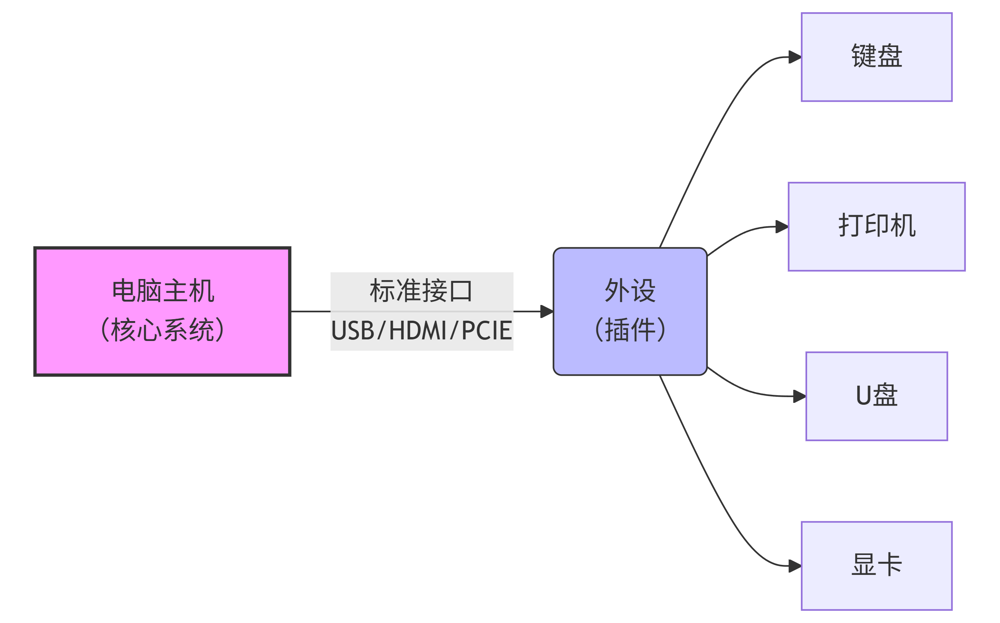
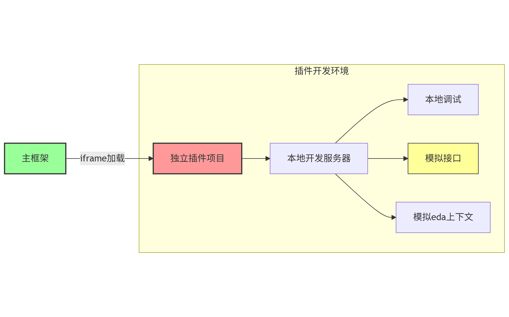
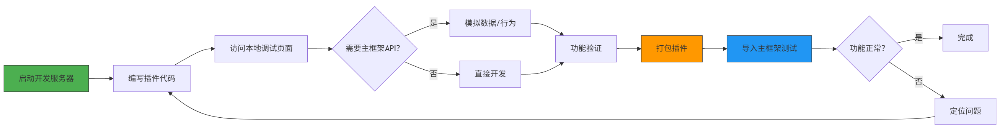
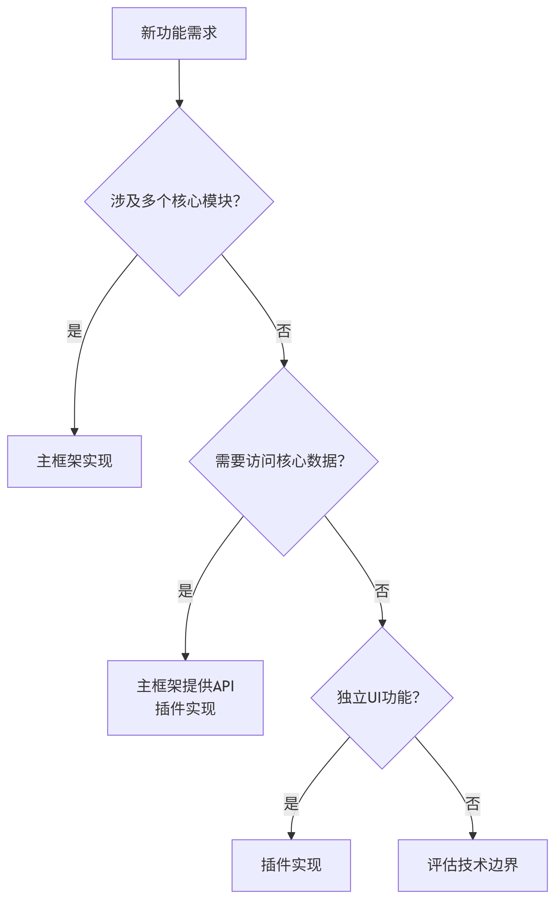

# 插件化开发实践

## 1. 插件化举例  

## 2. 开发环境及工作流
   2.1 开发环境
       

   2.2 开发工作流
       
   2.3 职责划分原则
       

## 3. 当前的挑战
   3.1 跨域导致接口不能在本地开发服务调试  
   3.2 主框架上下文没法真实的插到本地开发服务  
    总结：数据型接口可以通过mockService解决，功能型接口模拟困境 